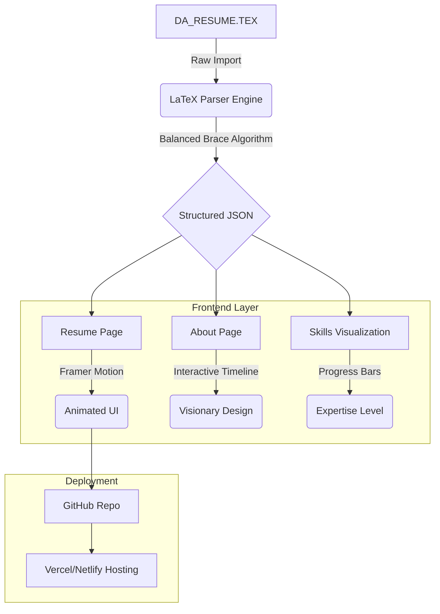

# 🚀 Shivanshu Tiwari | AI & Defense Innovation Portfolio

A state-of-the-art personal portfolio and automated resume system designed for AI researchers and defense technologists. This project features a unique **LaTeX-to-Web** synchronization engine, futuristic animations, and a high-performance interactive UI.


## 🛠️ System Architecture

The following diagram illustrates how the portfolio dynamically parses and displays resume data from LaTeX source:



## ✨ Key Features

- **📄 Dynamic LaTeX Sync**: Automatically updates the web profile whenever the `DA_RESUME.TEX` file is modified. No more manual data entry.
- **🛡️ Defense-Tech Aesthetic**: Specialized "Command Center" and "Mission Briefing" UI themes with real-time background code animations.
- **📊 Interactive Skill Bars**: Visualized expertise levels with staggered loading animations and gradient fills.
- **🔗 Automated Project Discovery**: Smart parser extracts GitHub links directly from LaTeX `\href` commands.
- **📥 One-Click Export**: Visitors can download the professional LaTeX source directly from the header.
- **📱 Responsive Mission Control**: Optimized for mobile, tablet, and desktop viewing.

## 🧰 Tech Stack

| Category       | Technology                           |
| :------------- | :----------------------------------- |
| **Framework**  | React 18 (Vite)                      |
| **Logic**      | TypeScript                           |
| **Styling**    | Tailwind CSS                         |
| **Animations** | Framer Motion                        |
| **Icons**      | Lucide React                         |
| **Backend**    | Supabase (State Management)          |
| **Parsing**    | Custom Regex & Brace Matching Engine |

## 🚀 Local Development

To run this project locally:

```bash
# Clone the repository
git clone https://github.com/imshivanshutiwari/portfolio.git

# Navigate to directory
cd portfolio

# Install dependencies
npm install

# Start development server
npm run dev
```

## 📬 Contact & Socials

- **LinkedIn**: [imshivanshutiwari](https://linkedin.com/in/imshivanshutiwari)
- **GitHub**: [@imshivanshutiwari](https://github.com/imshivanshutiwari)
- **Email**: imshivanshutiwari@gmail.com

---

Developed with ❤️ for the future of Intelligence & Defense.
